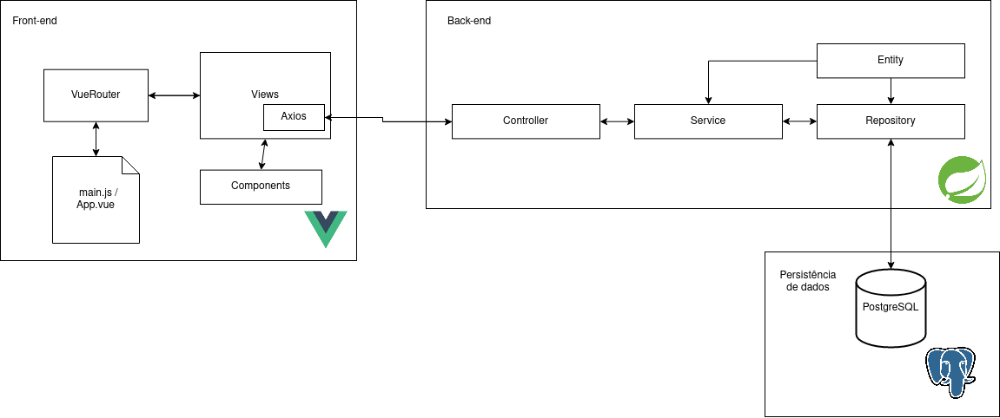

# CRUD Filmes

Aplicação fullstack focada em fazer um gerenciamento básico de filmes.

## Funcionalidades

- Listar filmes;
- Realizar cadastro de filme;
- Visualizar informações de um filme;
- Atualizar informações do filme;
- Apagar filme.

## Diagrama de Classes

## Requisitos funcionais

| Requisito | Título | Descrição |
| --- | --- | --- |
| [RF001] | Gerenciar Filmes | O usuário poderá fazer o cadastro, a atualização e a remoção de um filme

## Tecnologias

- Vue3;
- Vuetify;
- VueRouter;
- Axios;
- Spring Boot;
- PostgreSQL.

## Arquitetura

## Rotas da API

| Método HTTP | URL          |
| ----------- | ------------ |
| GET         | /movies      |
| POST        | /movies      |
| GET         | /movies/{id} |
| UPDATE      | /movies/{id} |
| DELETE      | /movies/{id} |
